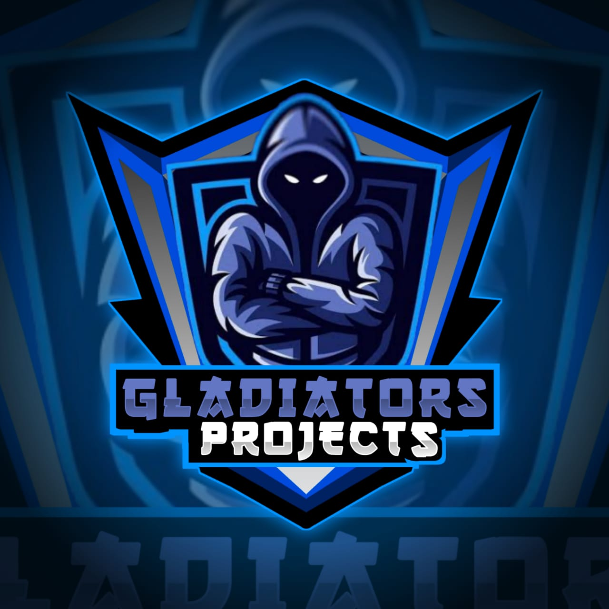

<!--This Bot is Made By Gladitors Project-->

  

### 🚀 Gʟᴀᴅɪᴀᴛᴏʀs SᴘᴀᴍBᴏᴛ

  
  
  

### Deploy to Heroku
  
  
  

### 🛠️ Lᴀɴɢᴜᴀɢᴇs Aɴᴅ Tᴏᴏʟs

  
  
  
  

## 🗒️ Nᴇᴄᴇssᴀʀʏ Vᴀʀɪᴀʙʟᴇs

☞ `API_ID` - Get your API_ID from [my.telegram.org](https://my.telegram.org/) 
☞ `API_HASH` - Get your API_HASH from [my.telegram.org](https://my.telegram.org/) 
☞ `BOT_TOKEN` - Your Bot-Token get that from BotFather!! 
☞ `LOGS` - Your logger group id get that using any other bot!! 
☞ `BOT_ID` - Your bot id get that using any other bot!! 
☞ `OWNER_ID` - User id of the master get that using any other bot!! 
☞ `MASTER_NAME` - Name of the master, whivh will be displayed in bots dm!!

## 📌 Credits 
* 
* [Yukki-Bot](https://github.com/YukkiBot/YukkiMultiSpamBot) For Base
* [Ultroid](https://github.com/TeamUltroid/Ultroid) For Some Plugins
* [Yone-Bot](https://github.com/noob-kittu/YoneRobot) For Curses
